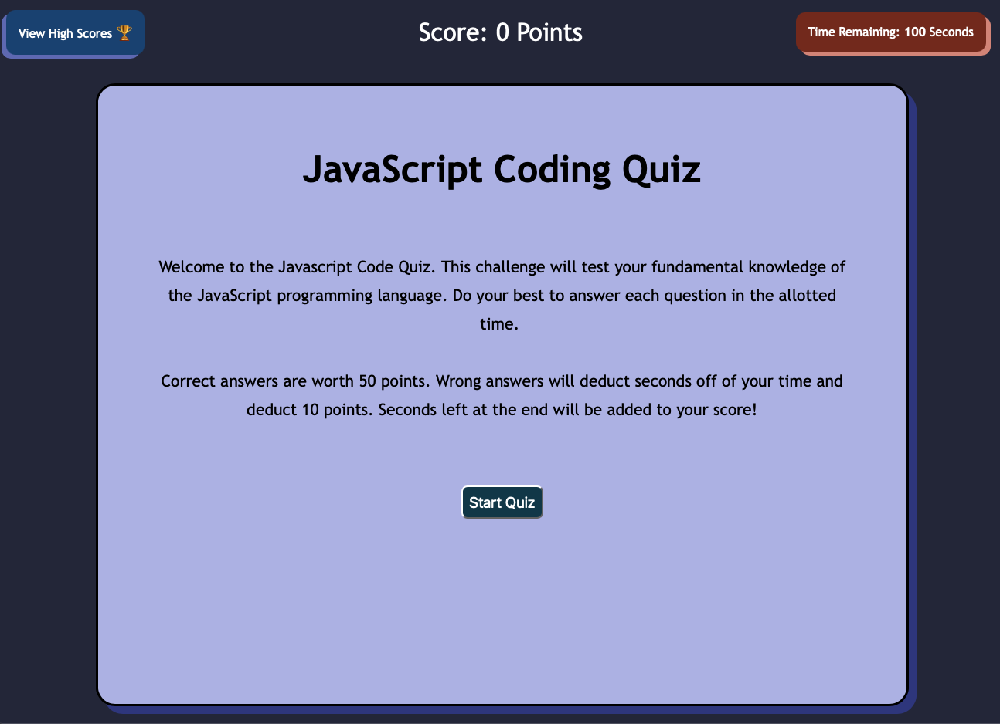
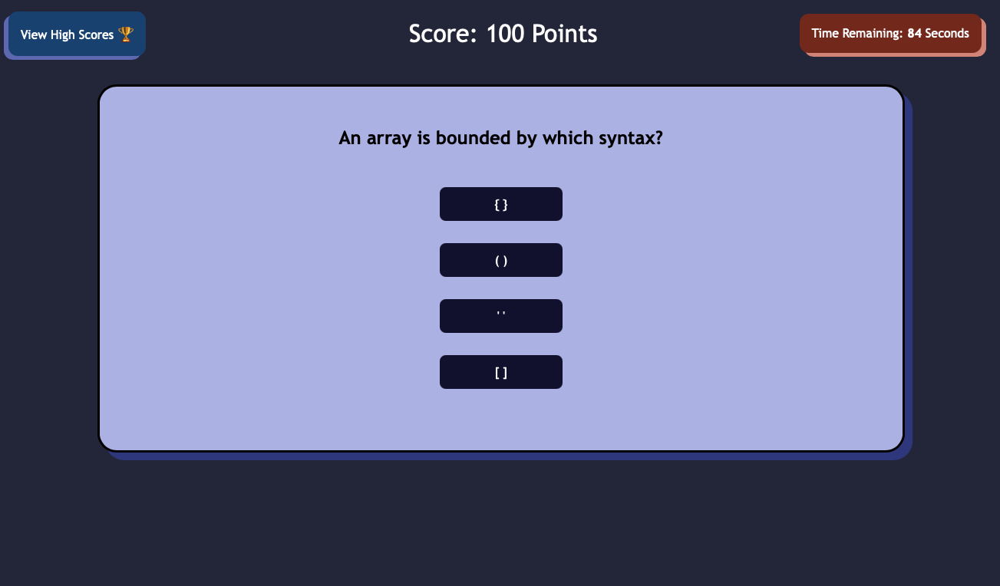
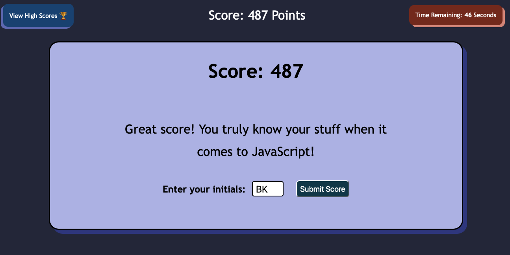
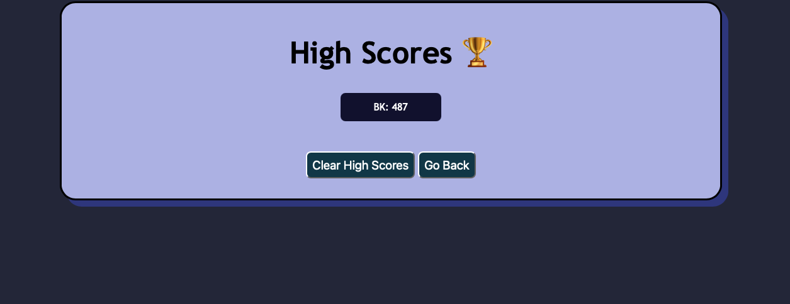

# JS-Code-Quiz
This is a code quiz that tests the user on the basics of the JavaScript programming language. It consists of 10 questions, a score and an option to save/post scores. Please read below for details on how this application works, where you can access this application and Github repo, and see screen shots. 

## How does this application work?
**Below is a detailed breakdown of how this application works:**

1. The user opens the application using the Live URL link below.

2. The user reads instructions on the main page and clicks START when they are ready to begin
    - The quiz is 10 questions long and the user has 100 seconds to complete it
    - Each question is worth 50 points for the correct answer
    - Each wrong answer will deduct 10 points off of the score (cannot go below 0) and 10 seconds off of the timer.
    - Whatever seconds are left at the end of the quiz will be added to the score.

3. The user will click through each of the 10 questions, answering basics about JavaScript
    - Correct answers will be shaded green when selected
    - Incorrect answers will be shaded red when selected
    - If the timer falls below 15 seconds, the numbers will turn red

4. The user will be presented with a final score, a message, and an option to enter their initials to submit their score

5. If the user submits their initials, they will see the list of all the scores in their local storage. They can then go back to retake the quiz or clear the scores.
    - There is also an option at anytime to click the High Scores button in the top left corner of the main page to go see the scores

## Accessing the application
Below are the links to the live application (.io URL) and the link to the Github Repo.

**Live URL:** https://bckasper.github.io/JS-Code-Quiz/ 

**Github Repo:** https://github.com/bckasper/JS-Code-Quiz

## Screenshots

